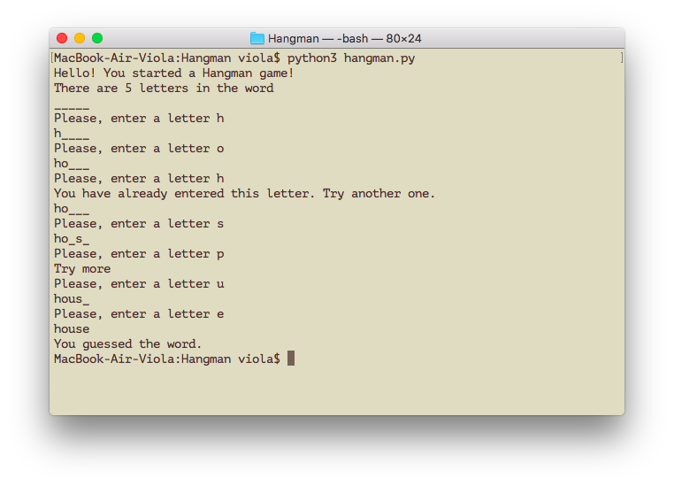

# Hangman
Python CLI application for Hangman game

### Description
Hangman is the game where you need to guess a word. You have a limited number of tries.
In the program, I implemented choosing a random word from the predefined list.
A user needs to enter a letter by letter to guess it.
The program notifies if the user guessed the letter or not.

### Example of program execution

